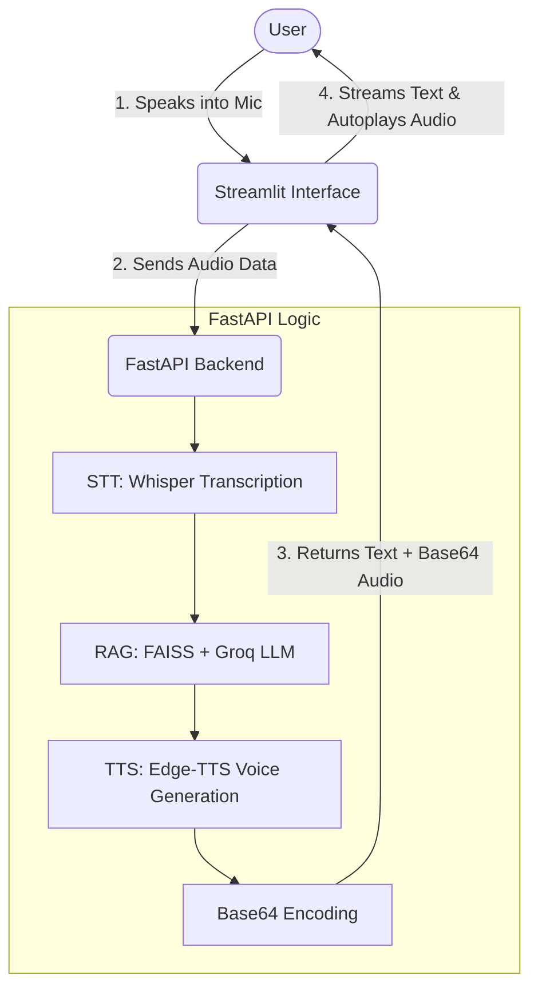

# 🎙️ Voice-Activated RAG Chatbot

An intelligent Voice-to-Voice RAG (Retrieval-Augmented Generation) application built using **FastAPI** and **Streamlit**. Talk to your data using AI and get responses both as a typing stream and as audio.

## 🔄 System Workflow



## 🚀 Key Features

- **STT (Speech-to-Text):** Transcribe your recordings using OpenAI Whisper (faster-whisper).
- **RAG (Retrieval-Augmented Generation):** Chatbot queries a vector database (FAISS) based on provided documents/URLs for accurate, data-driven answers.
- **TTS (Text-to-Speech):** AI answers are converted to voice using `edge-tts`.
- **ChatGPT-Style UI:** Interactive Streamlit interface with a typing effect (streaming) for responses.
- **FastAPI-Backend:** High-performance asynchronous API to handle all AI processing.

## 🛠️ Requirements

- **Python:** 3.12+
- **API Keys:** A Groq API key (for Large Language Model processing).
- **System Dependencies:**
  - `ffmpeg` (required for audio processing).
  - **Visual Studio C++ Runtime:** This is required for your Windows environment to support AI libraries like `FAISS`, `faster-whisper`, and `docling`.
    - [Download All Visual Studio C++ Runtimes (AIO)](https://www.techspot.com/downloads/6776-visual-c-redistributable-package.html)

## 📦 Installation

### 1. Clone the repository

```bash
git clone <repository_url>
cd voice_rag
```

### 2. Set up a Virtual Environment with uv

```bash
uv venv
source .venv/bin/activate  # On Windows use: .venv\Scripts\activate
```

### 3. Install dependencies

```bash
uv sync
```

### 4. Configuration

Create a `.env` file in the root directory and add your Groq API Key:

```env
GROQ_API_KEY=your_groq_api_key_here
```

*(Check `config/config.yaml` to adjust models or data sources like PDF locations and URLs).*

## 🏎️ How to Run

To get the full system running, you need to start the backend first, then the frontend.

### Step 1: Start the FastAPI Backend

Open your terminal and run:

```bash
python app.py
```

*The API will be available at `http://localhost:8000`.*

### Step 2: Start the Streamlit Frontend

Open a **new** terminal window (keeping the first one running) and run:

```bash
streamlit run streamlit_app.py
```

*The UI will automatically open in your browser at `http://localhost:8501`.*

## 📂 Project Structure

- `app.py`: The FastAPI server entry point.
- `streamlit_app.py`: The frontend user interface.
- `src/mysoft_rag/`: Core logic for RAG, STT, and TTS services.
- `config/config.yaml`: Configuration settings for AI models and data paths.
- `vector_database/`: Storage for the processed PDF and URL data.

## 📝 Usage

1. **Wait for Init:** The first time you run it, you may need to initialize the vector database via the `VectorStore` class if not already done.
2. **Text Chat:** Type your question in the text area and press "Send Text Message".
3. **Voice Chat:** Click "Start Recording", speak your query, "Stop Recording", and then "Send Voice Message".
4. **Enjoy:** You'll see the bot type the answer like ChatGPT and hear its response!